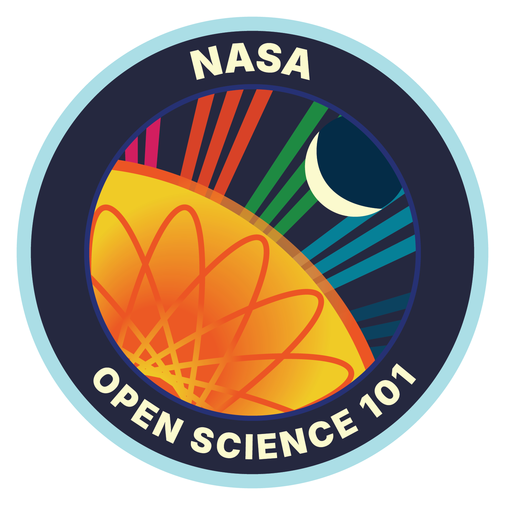

**<h1 align="center">Hi, I'm Alex Smagin</h1>**
<h3 align="center">Senior Software Engineer building full-stack applications with React, Node.js, TypeScript, and AWS. Passionate about clean code, open source, and developer growth.</h3>

🚀 Check Out My **Portfolio** website to explore my 𝐩𝐫𝐨𝐣𝐞𝐜𝐭𝐬 and see how I can contribute to your team or project: [𝐚𝐥𝐞𝐱𝐬𝐦𝐚𝐠𝐢𝐧.𝐝𝐞𝐯](https://alexsmagin.dev). If you find something that resonates with you, feel free to react out!💼 💻

👨‍💻 [🅰🅻🅴🆇🆂🅼🅰🅶🅸🅽.🅳🅴🆅](https://www.alexsmagin.dev/)

<h3 align="left">Connect with me:</h3>

<a href="https://www.alexsmagin.dev/" target="_blank" rel="noreferrer"> <picture> <source media="(prefers-color-scheme: dark)" srcset="https://raw.githubusercontent.com/danielcranney/readme-generator/main/public/icons/socials/devdotto-dark.svg" /> <source media="(prefers-color-scheme: light)" srcset="https://raw.githubusercontent.com/danielcranney/readme-generator/main/public/icons/socials/devdotto.svg" />  </picture> </a><a href="https://www.youtube.com/@AlexSmaginDev" target="_blank" rel="noreferrer"> <picture> <source media="(prefers-color-scheme: dark)" srcset="https://raw.githubusercontent.com/danielcranney/readme-generator/main/public/icons/socials/youtube-dark.svg" /> <source media="(prefers-color-scheme: light)" srcset="https://raw.githubusercontent.com/danielcranney/readme-generator/main/public/icons/socials/youtube.svg" />  </picture> </a><a href="https://linkedin.com/in/alex-smagin29" target="_blank" rel="noreferrer"> <picture> <source media="(prefers-color-scheme: dark)" srcset="https://raw.githubusercontent.com/danielcranney/readme-generator/main/public/icons/socials/linkedin-dark.svg" /> <source media="(prefers-color-scheme: light)" srcset="https://raw.githubusercontent.com/danielcranney/readme-generator/main/public/icons/socials/linkedin.svg" />  </picture> </a><a href="https://x.com/alexsmagin29" target="_blank" rel="noreferrer"> <picture> <source media="(prefers-color-scheme: dark)" srcset="https://raw.githubusercontent.com/danielcranney/readme-generator/main/public/icons/socials/twitter-dark.svg" /> <source media="(prefers-color-scheme: light)" srcset="https://raw.githubusercontent.com/danielcranney/readme-generator/main/public/icons/socials/twitter.svg" />  </picture> </a><a href="https://discord.gg/t6MGsCqdFX" target="_blank" rel="noreferrer"> <picture> <source media="(prefers-color-scheme: dark)" srcset="https://raw.githubusercontent.com/danielcranney/readme-generator/main/public/icons/socials/discord-dark.svg" /> <source media="(prefers-color-scheme: light)" srcset="https://raw.githubusercontent.com/danielcranney/readme-generator/main/public/icons/socials/discord.svg" />  </picture> </a>

<a href="https://www.codewars.com/users/Alexandrbig1">

<h3 align="left">Licenses & certifications:</h3>

<h3 align="left">Languages and Tools:</h3>

&nbsp;

 <em><b>I love connecting with different people</b> so if you want to say <b>hi, I'll be happy to meet you more!</b> :)</em>

